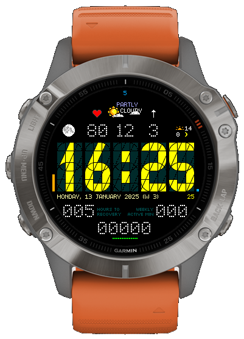

# Segment34
A watchface for Garmin Fenix 6 with a 34 Segment display

The watchface features the following:

 - Time displayed with a 34 segment display
 - Phase of the moon with graphic display
 - Heartrate
 - Weather (conditions, temperature and windspeed)
 - Sunrise/Sunset
 - Date, week number
 - Notification count
 - Time to recovery
 - Active minutes per week
 - Steps
 - Battery days remaining as bar
 
 The watchface have no settings screen and is currently not published to the IQ Connect store.

## Builds
 There are builds for Fenix watches in the builds folder.
 
 The build in the fenix6 folder should work for Fenix 6 and Fenix 6 Pro.
 The build in the fenix7 folder should work for Fenix 7, Fenix 7 Pro and Fenix 8 Solar 47mm.

 Connect your watch via usb and transfer the Segment34.prg file to the GARMIN/Apps folder on the watch. 
